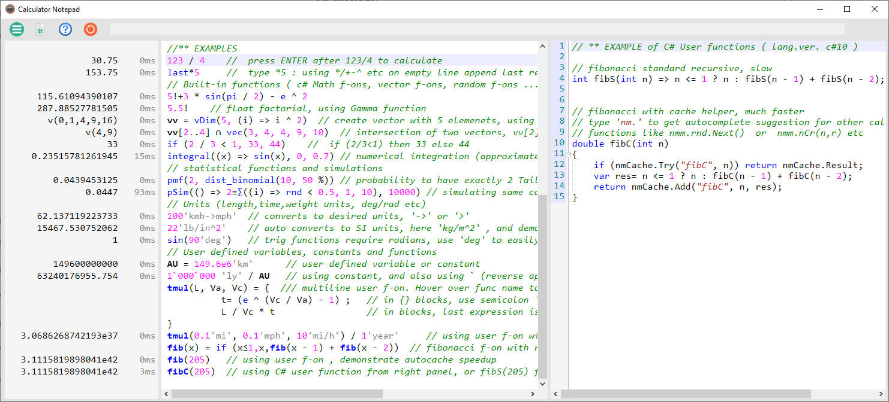
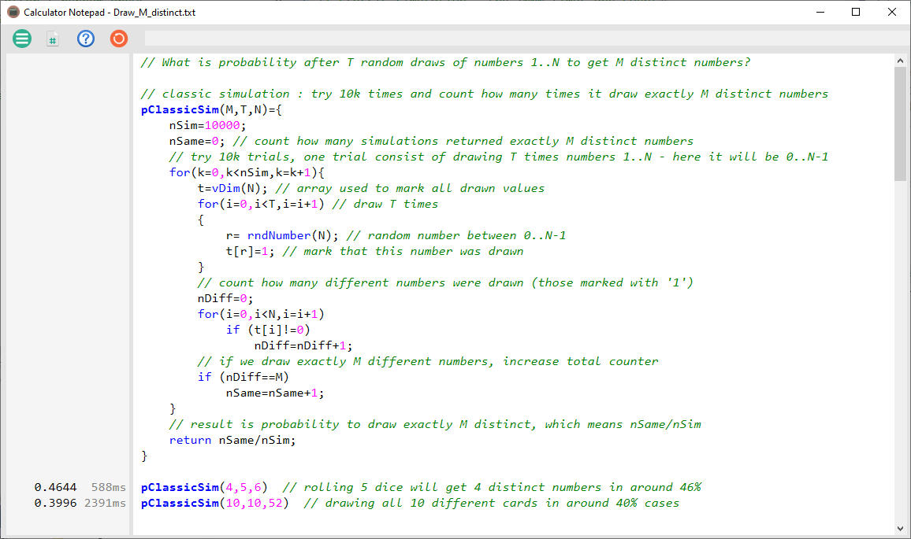
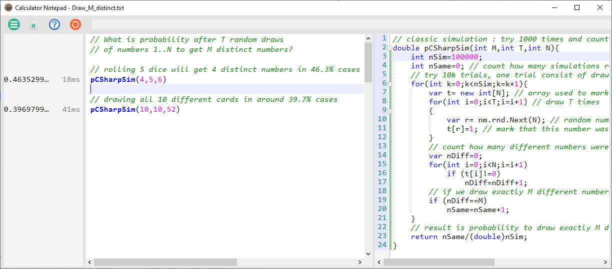
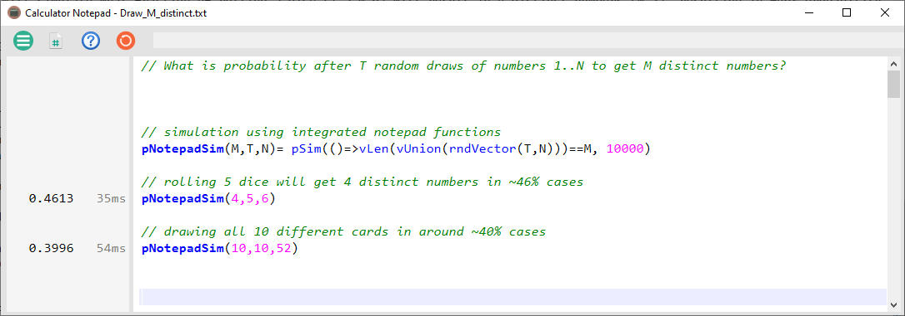
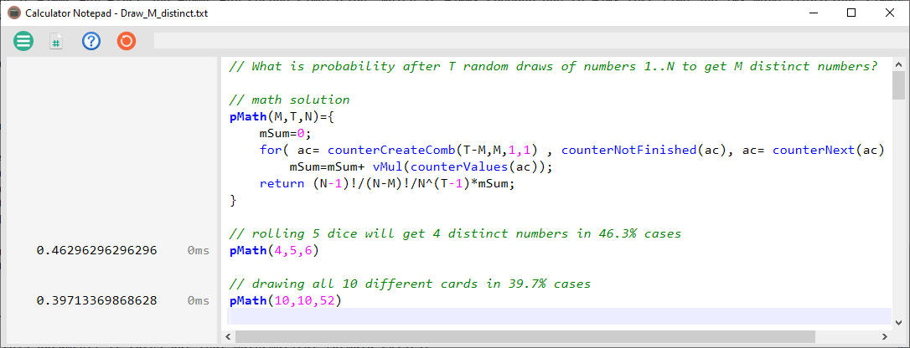

# CalculatorNotepad

CalculatorNotepad is intended for easy calculations with support for user defined functions/formulas and rich set of integrated mathematical and probability functions.

It can be used as simple calculator with each line showing calculation result, but it also support user variables (storing results of previous calculations and using them in new calculations)
and user defined functions that can be written as simple one line or multiline using integrated script language (or as c# functions in side panel). 

It is also suitable for simple simulation scenarions, with support for random numbers using different distributions and simulation aggregation functions.

## Overview of supported features
- simple use of math functions, variables and user defined functions 
- support using of units ('kg','in'..), their conversion and user defined units
- support vectors and many functions working on vectors (vec,vDim,vFunc,vSum...)
- provide random generating functions for simulations ( random, rndChoose/Weighted ...)  
- allows easy definition of new user functions using custom language
    - simple single line definitions in the form `myF(a,b)= 3*a+b`
    - functions can be multiline `f(a,b)={ ... new lines... }`
    - notepad language support conditions (`if`/`else`), loops (`for`,`while`), global/local variables
    - most block functions (like `if`,`for`,`while`...) have single-line versions similar to Excel
    - alternative to notepad functions are user defined c# functions 
    - user defined notepad functions can call other user defined notepad or c# functions
    - notepad user functions can be recursive (notepad does auto cache optimization) 
- allow definition of C# user functions (in right C# panel, enabled by 2nd toolbar icon )
    - instantly usable in notepad, allow for complex/faster functions
- Syntax Highlighting of both Notepad and C# panels
    - matching parentheses are highlighted, use Ctrl-Arrows to jump between them
- Autocomplete for Notepad and C# panels
    - Notepad autocomplete also show help/descriptions for builtin custom language functions
    - Ctrl-Space to show all, or automaticaly shown after first typed characters
- Menu (leftmost toolbar icon) allows Load,Save and Options settings
    - Preset file allow permanent user defined functions and constants

## Examples for notepad features
Basic way to get additional information about notepad language features is to use **autocomplete** which will automatically appear after first entered letter(s), 
listing notepad functions starting with those letters and describing their syntax and usage. Alternativelly, pressing Ctrl-Space will list all available notepad language functions even without entering first letter. 

But since just parsing all available functions can be tedious, this section will introduce some basic concepts. Instead of doing it for different syntax or function groups, 
it will use few 'real life' scenarios - those will show not only basic notepad functionality but also demonstrate few problems that are suitable to be solved using CalculatorNotepad.

### Draw M distinct numbers
First problem to be used is one related to probability, since it can show both simulation and calculation features:
> What is probability after T random draws (with replacement) of numbers 1..N to get M distinct numbers: p(M,T,N)=?

Few specific examples:
> What is probability after rolling 5 dice to get 4 distinct numbers, p(4,5,6)=?

> What is probability after drawing card 10 times out of reshuffled deck to get all different cards, p(10,10,52)=?

#### Classical solution
Usual initial approach when solving this type of problems is to make simple simulation that does not require us to solve it mathematically and yet will produce approximate result.
One way to do it in CalculatorNotepad would be:

This 'classic' solution demonstrate several basic features of CalculatorNotepad:
- user defined function `pClassicSim(M,T,N)`, which in this case is not simple one-liner but in `{}` block with multiple lines ( each ending in semicolon `;` )
- function parameters `(M,T,N)` which are passed when function is called. Note that they do not have type - all variables in notepad language are either numbers or vectors (arrays of numbers or other vectors)
- declaration and use of local variables inside function ( like `nSim`,`nSame`). Notepad support nested names in inner blocks.
- `for` loop block with syntax `for([init],condition,[iterator]) body`
    - in this case body is another block inside `{}`
    - unlike c#, notepad `for` parameters are separated by commas ( `for` is actually just another function, and thus usable in one-liners )
- arrays in notepad language are 'vectors', and one is declared here with `t=vDim(size)` syntax
    - elements of vectors/arrays are accessible with usual `t[i]` syntax
    - there is large number of integrated vector functions, like `x=vec(1,2,3)` or `vLen(x)` or `vMax(x)`
    - they all have names in the form `vSomething` so autocomplete will show them upon typing 'v'
    - this specific vector 't' is used as boolean array, to mark all numbers that were drawn in one trial
- random number generation, with `r= rndNumber(N)` which return random integer between 0 and N-1 inclusive
    - there is large number of integrated random functions like `rnd`, `rndVector`, `rndShuffle`, `rndChoose` - again, use autocomplete on 'rnd'
    - there is also support for different random distributions, other than uniform one, try autocomplete on 'dist' - but they may be used in different example
- function return uses standard `return` keyword, and support mid-function returns
    - but in absence of `return` keywords, functions return last calculated value, thus `f(x)=3*x` will naturally return 3*x
- calling of user defined functions is using same format as calling integrated functions
    - in this case `pClassicSim(4,5,6)` will simulate what fraction of rolling 5 dice (T=5,N=6) will result in 4 distinct numbers (M=3), resulting in ~46% probability
    - also `pClassicSim(10,10,52)` will simulate drawing 10 cards (T=10) out of reshuffled deck (N=52) with all different cards (M=10), resulting in ~40% probability

This example exist as [file](TestCases/Examples/Draw_M_distinct.txt) in 'TestCases\Examples' folder, but if it was written as new solution then usual next step would be to save it.
Saving notepad files is available from menu ( upper left icon  with three horizontal bars ), using 'Save As' to name new file. 
But even if user exit CalculatorNotepad without saving, latest notepad remains remembered and will be loaded upon next app start.

Results from last two lines show probability after calling user defined `pClassicSim` function with suitable parameters. 
They also demonstrate one feature of CalculatorNotepad - it recalculate only those lines at and below last changed line. 
Thus if you add space after `pClassicSim(10,10,52)` line and move cursor down, it will recalculate that line, and naturally get slightly different result 
( due to use of random numbers in simulation), but will not recalculate line above. 

Those results in last two lines show something else too -  execution time, with some 0.5sec needed for first case and 2.5sec for second case. 
Those numbers would be 10x larger if we simulated 100k times instead of just 10k times. This demonstrate one important limitation of notepad language - 
it is interpreted as opposed to compiled. That has impact on its performance, but allows language to remain as flexible as needed. 

#### C# notepad panel
Alternative approach, for those cases where we need complex calculations for hundreds of thousands iterations, would be to use another feature of CalculatorNotepad : user defined functions in c# panel. 
That panel is shown upon pressing second icon  from the left, splitting notepad in two horizontal areas. Those areas, just like rest of notepad, can be freely resized.

This 'c#' solution demonstrate several features:
- it shows that notepad language is (intentionally) similar to c# ... only few changes to previous code was needed (mainly typing variables)
- `nm.rnd` is global variable in 'nm' namespace. That 'nm' namespace contains many useful CalculatorNotepad functions and classes. In this case it only replace need for `var rnd= new Random();` in C# code.
- c# user functions are callable from notepad as soon as typed - they are internally compiled as soon as focus shift to notepad panel
- naturally, c# functions are much faster at ~20ms for first and ~40ms for second simulation, which is ~200x speedup due to ~20x less time and 10x more iterations (100k vs 10k)
- another feature demonstrated here is shortening of results if result panel is shrunk too much - numbers are shown with elipsis(...) to indicate they are not shown entirely. 
- when notepad that contain c# code is saved, it saves c# code in same TXT file as notepad code

#### Using notepad vector functions
Yet another approach would be to use other integrated functions of notepad language - that could not only improve performance compared to 'classic' approach,
but also make solution much simpler:

This result in single line simulation function, using following integrated notepad functions:
- `rndVector(T,N)` generate vector with T random numbers, each between 0..N-1 (thus generating T random numbers we needed)
- `vUnion(vector1 [,vector2...])` create union of one or more vectors, with only distinct elements ( since we want to count distinct results)
- `vLen(vector)` return number of elements in vector ( thus counting how many distinct results we had in one trial)
- `pSim(()=>boolFunc, nSimulations)` repeat supplied boolean function 'nSimulations' times, and report percentage it returns true
    - thus `pSim(()=> vLen(..)==M, 10000)` will repeat 10k times and count when number of distinct values (vLen) equals M, returning fraction of successes
    - this also demonstrate that notepad language support lambda functions as parameters for many integrated functions (integrals, root finders, sums...)
    - `pSim` function is useful in most simulations, to count single trials
- it also demonstrate improved speed compared to 'classical' solution, at 35ms and 55ms it is around 30x faster than classical solution
    - c# panel solution is still some 10x faster, but it is much more code compared to using integrated notepad functions

#### Mathematical solution
While this ability to write simulation in single line is one of strengths of CalculatorNotepad, another strength is when used not for simulations but for actual mathematical calculations.
In this case that would require solving this as mathematical problem and coming up with formula for pMath(M,T,N). 
While solving that is outside scope for this document, it turns out that mathematical formula exists:
> pMath(M,T,N)= (N-1)!/(N-M)!/N^(T-1)*Psum(T-M,M)

Where `Psum(d,m)` is sum of product of all non-descending arrangements of 'd' numbers, where each number can go from 1 .. 'm'. Some examples:
> Psum(2,3)= 3x3 + 2x3 + 2x2 + 1x3 + 1x2 + 1x1

> Psum(3,3)= 3x3x3 +2x3x3 +2x2x3 +2x2x2 +1x3x3 +1x2x3 +1x2x2 +1x1x3 +1x1x2 +1x1x1

Classical solution to calculate `Psum(d,m)` would require program with D nested loops, where D is not fixed at program time but supplied as parameter. 
This is not trivial to program even in high-end languages like c#, and it would require probably several pages of error-prone code. 
Luckily, CalculatorNotepad have **counter** integrated functions that can help here :

User defined function `pMath(M,T,N)` uses above mentioned formula, and simplify calculation of `Psum(d,m)` by using integrated counter functions:
- `counterCreateComb(numDigits, maxValue, minValue, canRepeat)` : create 'combination' counter where order does not matter, so it is always non-descending
    - as used in `counterCreateComb(d,m,1,1)`, it counts 'd' digits, each 1..m, and allows repeat ( so 3*3*3 is allowed)
    - since it is 'combination' counter, it automatically include only combinations without repeating, so if [2,3] is returned, it will not return [3,2]
        - for example, `counterCreateComb(2,4)` will count 12,13,14,23,24,34
        - there are different versions of counters: `counterCreatePerm` will count all permutations, and `counterCreate` will count all possible values
    - `counterCreateXX` functions return actual counter as a vector, which is here put in variable 'ac'
- `counterNotFinished(ac)` return true if counter is not finished counting. It works for all types of counters, and here used as `for` condition
- `ac= counterNext(ac)` iterate to next valid counter combination, and store it back in 'ac'. When it reach last valid combo, next `counterNotFinished` will be false
- `counterValues(ac)` return vector with current counter values, eg `vec(2,3,3)`
- `vMul(vector)` return product of each element in vector, so if we had `vec(2,3,3)` this will calculate 2x3x3
- naturally, execution time of mathematical calculation is instant (~0ms)
- this demonstrate very simple notepad code that would be fairly complex if done using standard languages like C#

## Technical details
CalculatorNotepad is written in **C#** and latest version is updated for **Net 7**, using some experimental features like [C# generic math](https://devblogs.microsoft.com/dotnet/dotnet-7-generic-math/) 
for common number type that supports several floating points: standard 64-bit double, custom 128-bit Quad and variable length MPFR. That experimental features require Visual Studio **2022 Preview**.

There are several libraries that are used in this project:
- [FastColoredTextBox](https://github.com/PavelTorgashov/FastColoredTextBox/blob/master/FastColoredTextBox/FastColoredTextBox.cs) - modified version used for code panels
- [Quad](https://github.com/Razenpok/BreakInfinity.cs/blob/master/BreakInfinity.Benchmarks/Quadruple/Quad.cs) - heavily modified version used for 128-bit Quad float number class
- [MPFR](https://github.com/MachineCognitis/Math.Mpfr.Native/) - modified source of nuget used as basis for MPFR number class

