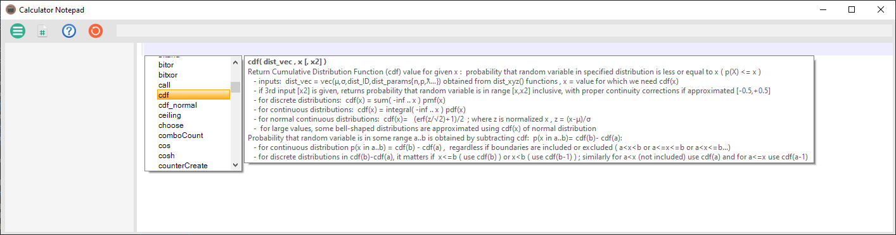

# CalculatorNotepad

CalculatorNotepad is intended for easy calculations with support for user defined functions/formulas and rich set of integrated mathematical and probability functions.

To use latest published version copy all files from repository `Release` folder. Alternatively, to get latest changes, compile C# `CalculatorNotepad.sln` solution with Visual Studio 2022 Preview or later.

It can be used as simple calculator with each line showing calculation result, but it also support user variables (storing results of previous calculations and using them in new calculations)
and user defined functions that can be written as simple one line or multiline using integrated script language (or as c# functions in side panel). 

It is also suitable for simple simulation scenarios, with support for random numbers using different distributions and simulation aggregation functions. Pressing  icon will show following examples:

## Overview of supported features
- simple use of math functions, variables and user defined functions 
- support using of units ('kg','in'..), their conversion and user defined units
- support vectors/arrays and many functions working on vectors (vec,vDim,vFunc,vSum...)
- provide random generating functions for simulations ( random, rndChoose/rndVector/Weighted ...)  
- allows easy definition of new user functions using custom notepad language
    - simple single line definitions in the form `myF(a,b)= 3*a+b`
    - functions can be multiline `f(a,b)={ ... multiple lines... }`
    - notepad language support conditions (`if`/`else`), loops (`for`,`while`), global/local variables
    - most block functions (like `if`,`for`,`while`...) have single-line versions similar to Excel
    - alternative to notepad functions are user defined c# functions writeable directly in notepad
    - user defined notepad functions can call other user defined notepad or c# functions
    - notepad user functions can be recursive (notepad does auto cache optimization and stack guard) 
- allow definition of C# user functions (in right C# panel, enabled by 2nd toolbar icon  )
    - instantly usable in notepad, allow for complex/faster functions
- Syntax Highlighting of both Notepad and C# panels
    - matching parentheses are highlighted, use Ctrl-Arrows to jump between them
- Autocomplete for Notepad and C# panels
    - Notepad autocomplete also show help/descriptions for builtin custom language functions
    - Ctrl-Space to show all, or automatically shown after first typed characters
- support multiple number types with different precision (number of digits and size of exponent): 
    - default 64-bit **Double**, 128-bit **Quad** and variable size **MPFR** 
    - they can be set as default type in options, and also mixed and used simultaneously
    - internal BinaryFloatNumber type is used for floating point bitwise operations
- Menu (leftmost toolbar icon ) allows Load,Save and Options settings
    - Preset file allow permanent user defined functions and constants
- Help icon  shows basic examples ( note that it also overwrite current notepad context - save before use )
- Reset icon  clears notepad

## Examples for notepad features
Basic way to get additional information about notepad language features is to use **autocomplete** which will automatically appear after first entered letter(s), 
listing notepad functions starting with those letters and describing their syntax and usage. Pressing `Enter` will accept currently selected function : 

Pressing Ctrl-Space will list all available notepad language functions even without entering first letter. When multiple functions start with same letters, or in case of Ctrl-Space, 
they are all shown and arrow up/down keys can be used to select one. Currently selected function from autocomplete will show its description, and pressing `Enter` will accept that function :

Alternative way to see same description of integrated function is to hover mouse over it. Hovering over user defined functions will usually show just its name and 'user defined function' description.
But it is possible to also set custom description for user functions, by using `///` comment before (or in same line) as user function name definition (that is triple `///`, as opposed to regular comment with `//`)

Since parsing all available functions just to get familiar with notepad language can be tedious, this section will introduce some basic concepts. Instead of doing it for different syntax or function groups, 
it will use few 'real life' scenarios - those will show not only basic notepad functionality but also demonstrate few problems that are suitable to be solved using CalculatorNotepad.

### E1) Fibonacci function
This is very simple example - function to calculate [Fibonacci number](https://en.wikipedia.org/wiki/Fibonacci_number) : 

> fib(0)=0, fib(1)=1,  fib(x)=fib(x-1)+fib(x-2) 

This simple example demonstrate several features of CalculatorNotepad:
- user defined function `fib(x)`, in this case defined in single line
- comments have `//` syntax, and can be used at the end of line
    - special comment `///` above or in same line as definition/name of user function will define autocomplete/hover description 
- `if` conditional used as Excel-like function with syntax `if(condition, true_expression, false_expression)`
    - note that `if` also has normal `if(condition)` true_expression_block `else` false_expression_block; variant
    - this functional **single line format** exist for some other functions like `while`, `for` etc
    - for single-line functions like `fib(x)` this functional form is more suitable
- condition `x≤1` uses 'less or equal' sign, which is alternative to using '<='
    - CalculatorNotepad support **alternative symbols** and Greek letters for most suitable functions and operators
    - examples are ≡/==, ≠/== , ≥/>=, ≤/<=, π/pi , √/sqrt , ∑/sum, ∏/product, ∫/integral, ∩/vIntersect, ....
    - there is even option in Menu/Options to 'Automatically replace known symbols' (disabled by default), which would for example replace 'sqrt' with '√' as soon as typed
- notepad support recursive calls, as seen here since `fib` calls same `fib` function
    - there is integrated stack guard that will report error instead of crashing app if user recursive function is not bounded and use too much of stack
- `fib(1000)` is example of using user defined function, which is used same as any integrated function
    - in this case x=1000 is large number for Fibonacci function which would need ages to compute if this was written in normal language like C# ( without some form of dynamic programming, such naive recursive solution would call `fib` function around 2^x times )
    - but CalculatorNotepad is using **automatic cache** for function results, so even recursive solutions would complete in same time as (often much more complicated) non-recursive functions. This case needed just 6ms.
    - while notepad c# functions do not automatically use cache, they can use `nmCache` class - see example of cached C# Fibonacci function with Help icon  or as a first image here
- `fib(2000)` is example where function result in infinite (∞), since actual result is larger than 10^308 limit for 'double' precision floating number 
    - this can be overcome by changing **default number format** in Menu\Options from 'Double 64-bit' to either 'Quad 128-bit' or 'MPFR' ( both Quad and MPFR can support huge exponent values)
    - alternative is to use **number literal suffix** for specific number type:  suffix 'm' means that number will be MPFR, and suffix 'q' means than number will be Quad
        - advantage of using number type literals is that it is possible to mix different types
        - note that CalculatorNotepad is doing automatic casting : Double > Quad > MPFR
        - that means any operation involving double and Quad will have Quad result, and any operation involving Double/Quad and MPFR will have MPFR result
        - it is similar to how C++/C# languages automatically cast int to double if 1+2.0 is used
        - disadvantage of using number type literals is that result will be displayed with number of decimals typical for default type ( even if it actually has larger precision )
            - so if default is Double it will show ~15 decimals in left result panel even for MPFR results, eg `fib(2000m) == 4.224696333392e417m`
            - if 'MPFR 127 bits' is set as default, if would show `fib(2000m) == 4.22469633339230487870672560234148278e417`
            - note that when MPFR is default, it does not show suffix 'm' ... it will instead show suffix 'd' for Double results
    - naturally, MPFR and Quad are slower than native Double. This is not visible in this simple example, but would be in cases where loop is executed hundreds of thousands times
    - this also demonstrate that notepad can work with infinite values - those can be valid result of computations, stored in variables, used as literal ∞ etc

This example exist as [file](TestCases/Examples/FibonacciExample.txt) in 'TestCases\Examples' folder, but if it was written as new solution then usual next step would be to save it.

**Saving** notepad files is available from menu ( upper left icon  with three horizontal bars ), using `Save As` to name new file, or `Save` to overwrite old file. 
But even if user exit CalculatorNotepad without saving, latest notepad remains remembered and will be loaded upon next app start.

### E2) Draw M distinct numbers
This example problem is related to probability, and it can show both simulation and calculation features of CalculatorNotepad:
> What is probability after T random draws (with replacement) of numbers 1..N to get M distinct numbers: p(M,T,N)=?

Few specific examples:
> What is probability after rolling 5 dice to get 4 distinct numbers, p(4,5,6)=?

> What is probability after drawing card 10 times out of reshuffled deck to get all different cards, p(10,10,52)=?

#### Classical solution
Usual initial approach when solving this type of problems is to make simple simulation that does not require us to solve it mathematically and yet will produce approximate result.
One way to do it in CalculatorNotepad would be:

This 'classic' solution demonstrate several basic features of CalculatorNotepad:
- user defined function `pClassicSim(M,T,N)`, which in this case is not simple one-liner but in `{}` block with multiple lines ( each ending in semicolon `;` )
- function parameters `(M,T,N)` which are passed when function is called. Note that they do not have type - all variables in notepad language are either numbers or vectors (arrays of numbers or other vectors)
- declaration and use of **local variables** inside function ( like `nSim`,`nSame`). Notepad support nested names in inner blocks.
    - variable is 'defined' first time it is assigned value. Notepad automatically use variables defined in outer blocks, so {x=1;{x=2} y=x} will result in y=2
    - in rare cases when one desires to create new variable in inner block with same name already defined in outer block, `new` keyword can be used
    - functions can also use 'global' variables (defined outside any function) as long as they are defined before/above that function
- `for` **loop** block with syntax `for([init],condition,[iterator]) body`
    - in this case body is another block inside `{}`
    - unlike c#, notepad `for` parameters are separated by commas ( `for` is actually just another function, and thus usable in one-liners )
- **arrays** in notepad language are 'vectors', and one is declared here with `t=vDim(size)` syntax
    - elements of vectors/arrays are accessible with usual `t[i]` syntax
    - there is large number of integrated vector functions, like `x=vec(1,2,3)` or `vLen(x)` or `vMax(x)`
    - they all have names in the form `vSomething` so autocomplete will show them upon typing 'v'
    - this specific vector 't' is used as boolean array, to mark all numbers that were drawn in one trial
- **random number** generation, with `r= rndNumber(N)` which return random integer between 0 and N-1 inclusive
    - there is large number of integrated random functions like `rnd`, `rndVector`, `rndShuffle`, `rndChoose` - again, use autocomplete on 'rnd'
    - there is also support for different random distributions in addition to uniform one, try autocomplete on `dist`
- function **return** uses standard `return` keyword, and support mid-function returns. Functions always return some value
    - in absence of `return resValue;` keyword (or in case of `return;` without result parameter) functions return last calculated value
    - thus `f(x)=3*x` will naturally return 3*x
- calling of user defined functions is using same format as calling integrated functions
    - in this case `pClassicSim(4,5,6)` will simulate what fraction of rolling 5 dice (T=5,N=6) will result in 4 distinct numbers (M=3), resulting in ~46% probability
    - and `pClassicSim(10,10,52)` will simulate drawing 10 cards (T=10) out of reshuffled deck (N=52) with all different cards (M=10), resulting in ~40% probability

This example exist as [file](TestCases/Examples/Draw_M_distinct.txt) in 'TestCases\Examples' folder.

Results from last two lines show probability after calling user defined `pClassicSim` function with suitable parameters. 
They also demonstrate one feature of CalculatorNotepad - it recalculate only those lines at and below last changed line. 
Thus if you add space after `pClassicSim(10,10,52)` line and move cursor down, it will recalculate that line, and naturally get slightly different result 
( due to use of random numbers in simulation), but will not recalculate line above. 

Those results in last two lines show something else too -  execution time, with some 0.5sec needed for first case and 2.5sec for second case. 
Those numbers would be 10x larger if we simulated 100k times instead of just 10k times. This demonstrate one important limitation of notepad language - 
it is **interpreted** as opposed to compiled. That has impact on its performance, but allows language to remain as flexible as needed. 
Note that execution time is not shown by default - it can be enabled in Menu/Options/Advanced Options as "Show execution time next to results". Same section allows setting timeout values for execution time.

#### C# notepad panel
Alternative approach, for those cases where we need complex calculations for hundreds of thousands iterations, would be to use another feature of CalculatorNotepad : user defined functions in c# panel. 
That panel is shown upon pressing second icon  from the left, splitting notepad in two horizontal areas. Those areas, just like rest of notepad, can be freely resized.

This 'c#' solution demonstrate several features:
- it shows that notepad language is (intentionally) similar to c# ... only few changes to previous code were needed (mainly typing variables)
- `nm.rnd` is global variable in '**nm**' namespace. That `nm` is short for 'NotepadMath'  and contains many useful functions and classes not present in C# by default. In this case it only replace need for `var rnd= new Random();` in C# code.
- c# user functions are callable from notepad as soon as typed - they are **internally compiled** as soon as focus shift to notepad panel
- naturally, c# functions are much faster at ~20ms for first and ~40ms for second simulation, which is ~200x speedup due to ~20x less time and 10x more iterations (100k vs 10k)
- another feature demonstrated here is shortening of results if result panel is shrunk too much - numbers are shown with ellipsis(...) to indicate they are not shown entirely. 
- when notepad that contain c# code is saved, it saves c# code in same TXT file as notepad code

#### Using notepad vector functions
Yet another approach would be to use suitable integrated (built-in) functions of notepad language - that could not only improve performance compared to 'classic' approach,
but also make solution much simpler:

This result in single line simulation function, using following built-in notepad functions:
- `rndVector(T,N)` generate vector with T random numbers, each between 0..N-1 (thus generating T random numbers we needed)
- `vUnion(vector1 [,vector2...])` create union of one or more vectors, with only distinct elements ( since we want to count distinct results)
- `vLen(vector)` return number of elements in vector ( thus counting how many distinct results we had in one trial)
- `pSim(()=>boolFunc, nSimulations)` repeat supplied boolean function 'nSimulations' times, and report percentage it returns true
    - thus `pSim(()=> vLen(..)==M, 10000)` will repeat 10k times and count when number of distinct values (vLen) equals M, returning fraction of successes
    - this also demonstrate that notepad language support lambda functions as parameters for many integrated functions (integrals, root finders, sums...)
        - lambda function was used here since `pSim` accepts parameterless boolean function, and we needed to use parameters (M,T,N) in simulation
    - `pSim` function is useful in most simulations, to count single trials
- it also demonstrate improved speed compared to 'classical' solution, at 35ms and 55ms it is around 30x faster than classical solution
    - c# panel solution is still some 10x faster, but it is much more code compared to using integrated notepad functions

#### Mathematical solution
While this ability to write simulation in single line is one of strengths of CalculatorNotepad, another strength is when used not for simulations but for actual mathematical calculations.
In this case that would require solving this as mathematical problem and coming up with formula for pMath(M,T,N). 
While solving that is outside scope for this document, it turns out that mathematical formula exists:
> pMath(M,T,N)= (N-1)!/(N-M)!/N^(T-1)*Psum(T-M,M)

Where `Psum(d,m)` is sum of product of all non-descending arrangements of 'd' numbers, where each number can go from 1 .. 'm'. Some examples:
> Psum(2,3)= 3x3 + 2x3 + 2x2 + 1x3 + 1x2 + 1x1

> Psum(3,3)= 3x3x3 +2x3x3 +2x2x3 +2x2x2 +1x3x3 +1x2x3 +1x2x2 +1x1x3 +1x1x2 +1x1x1

Classical solution to calculate `Psum(d,m)` would require program with D nested loops, where D is not fixed at program time but supplied as parameter. 
This is not trivial to program even in high-end languages like c#, and it would require lot of code. Luckily, CalculatorNotepad have **counter** integrated functions that can help here :

User defined function `pMath(M,T,N)` uses above mentioned formula, and simplify calculation of `Psum(d,m)` by using integrated counter functions:
- `counterCreateComb(numDigits, maxValue, minValue, canRepeat)` : create 'combination' counter where order does not matter, so it is always non-descending
    - as used in `counterCreateComb(d,m,1,1)`, it counts 'd' digits, each 1..m, and allows repeat ( so 3*3*3 is allowed)
        - last parameter is boolean 'canRepeat', and notepad follows C/C# convention than anything other than zero is true 
        - here `1` was supplied, but `true` and `false` are also supported as aliases to `1` and `0` respectively
    - since it is 'combination' counter, it automatically include only combinations without repeating, so if [2,3] is returned, it will not return [3,2]
        - for example, `counterCreateComb(2,4)` will count 12,13,14,23,24,34
        - there are different versions of counters: `counterCreatePerm` will count all permutations, and `counterCreate` will count all possible values
    - `counterCreateXX` functions return actual counter as a vector, which is here put in variable 'ac'
- `counterNotFinished(ac)` return true if counter `ac` is not finished counting. It works for all types of counters, and here used as `for` condition
- `ac= counterNext(ac)` iterate to next valid counter `ac` combination, and store it back in `ac`. When it reach last valid combo, next `counterNotFinished` will be false
- `counterValues(ac)` return vector with current counter values, eg `vec(2,3,3)`
- `vMul(vector)` return product of each element in vector, so if we had `vec(2,3,3)` this will calculate 2x3x3=18
- execution time of mathematical calculation is almost instant (~0ms) which, as expected, is both faster and more accurate than simulations
- this demonstrate very simple notepad code that would be fairly complex if done using standard languages like C#

### E3) Common denominators
Another example problem related to probability, which can demonstrate use of prime number functions:
> A huge bin is filled with distinctly numbered balls, and you choose two of them at random. What is the chance they share common denominator? 

Logic behind both simulation and mathematical solutions are explained in comments visible on above image, and it is simplified using some **prime** notepad functions :
- simulation is again very simple one liner, thanks to notepad fuctions
- `primePi(N)` return number of primes smaller or equal to given number N 
    - both number of balls `Nb` and number of primes among those balls `Np` are set in variables to be reused in comparison between simulations and calculations
- `prime(i)` return i-th prime (where 1st prime is 2)
    - there are other useful prime functions, like `primeNext`, `primesBetween`,`primeFactors`,`isPrime`
    - as usual, using autocomplete suggestion on `prime` will show all of them with their descriptions
    - primes are efficiently calculated, using optimized sieve algorithm up to N~2bil, and cached for further use
    - for larger numbers, modified Miller test is used
- `pSim(()=>boolFunc, nSimulations)` was explained in previous example - it execute simulation multiple times and count fraction of successes
- `gcd(a,b)` return greater common denominator of multiple integer numbers
- `rndNumber(N)` return integer random number in range 0..N-1 ( and thus +1 was used here to make it 1..N )
- `∏( (i)=> func(i), i_start, i_end)` calculate product of results of func(i) for each integer `i` in range `i_start..i_end`
    - `∏(...)` is equivalent to `product(...)`, and typing 'product' will also show autocomplete description
    - it uses lambda function with one parameter that returns number which will be multiplied
    - it is similar logic as other aggregate functions like `sum`, `integral` and even `solve`, unlike `pSim` which uses boolean parameterless lambda
- example shows that simulation result matches calculation result, and both are close to theoretical result for infinite N

## Additional features
In addition to features that can be seen in above examples, several other features could be mentioned ( in no particular order ):
- support for display in different number bases, like binary `bin` and hexadecimal `hex` , in addition to default `dec`
    - those commands are used alone in line, and all results after them are displayed in that number base
    - numbers can be entered as literals directly in binary base ( prefix `0b`, eg `x=0b101` ) or hexadecimal base ( prefix `0x`, eg `y=0xFF` )
    - or directly as any base, using prefix `0[base]`, for example  `0[3]11 == 4` or `0[16]FF == 0xFF == 0[10]255 == 255`
- support for bitwise operators on floating point numbers
    - `0b101.01 | 0b0.1` results in `0b101.11 == 5.75`
    - it support all number types, so can work with very large number of bits in MPFR 
    - it support exponentials ( eg `5e20 | 1e19`) and underflow/overflows (so eg `5e20 | 1e-30 == 5e20`)
- support for dozen different random distibutions ( uniform, normal, binomial, poisson ...  use `dist` to get full list in autocomplete)
    - each of them return distribution vector that can be used as parameter in common functions like `cdf`, `pmf`, `pdf`
    - for example, `d= dist_binomial(10,0.5)` would create in variable `d` distribution suitable for toss of 10 coins
        - `cdf(d,3)` would show probability to get 3 or less 'heads' out of those 10 tosses (~17%)
        - `pmf(d,3)` would show probability to get exactly 3 'heads' out of those 10 tosses (~11%)
    

## Technical details
CalculatorNotepad is written in **C#** and latest version is updated for **Net 7**, using some experimental features like [C# generic math](https://devblogs.microsoft.com/dotnet/dotnet-7-generic-math/) 
for common number type that supports simultaneous use of several floating point types: standard 64-bit double, custom 128-bit Quad and variable length MPFR. That experimental features require Visual Studio **2022 Preview**. 
It is windows application since it uses WinForms and some specific Win32 APIs.

There are several libraries that are used in this project:
- [FastColoredTextBox](https://github.com/PavelTorgashov/FastColoredTextBox/blob/master/FastColoredTextBox/FastColoredTextBox.cs) - modified version used for code panels
- [Quad](https://github.com/Razenpok/BreakInfinity.cs/blob/master/BreakInfinity.Benchmarks/Quadruple/Quad.cs) - heavily modified version used for 128-bit Quad float number class
- [MPFR](https://github.com/MachineCognitis/Math.Mpfr.Native/) - modified source of nugget used as basis for [MPFR](https://www.mpfr.org/) number class

